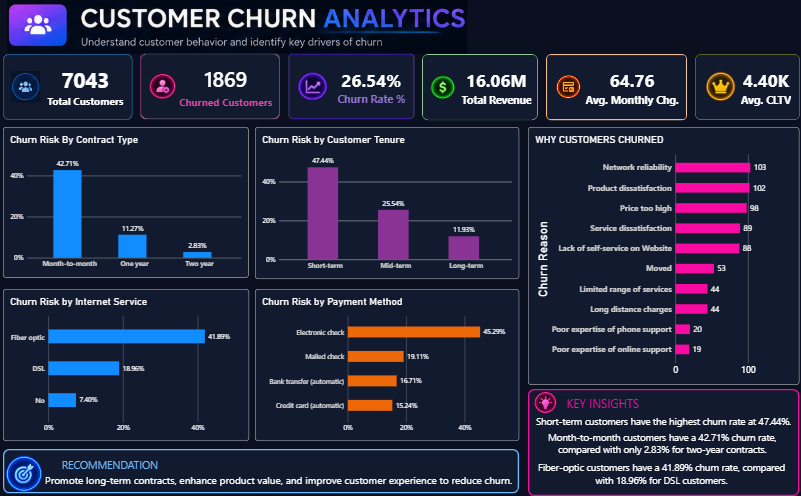

# 📊 Customer Churn Analytics Dashboard

An end-to-end customer churn analytics project built using Excel, MySQL, Python (Pandas), and Power BI to identify customer churn patterns, analyze key churn drivers, and generate actionable business recommendations.

## 🎯 Business Objective

The objective of this project is to understand customer churn behavior and identify customer segments and service characteristics associated with higher churn rates.

The analysis focuses on:

* Customer demographics
* Contract type
* Customer tenure
* Internet service
* Payment methods
* Churn reasons
* Customer lifetime value (CLTV)
* Monthly and total charges

---

## 📸 Dashboard Preview



---

## 🛠️ Tools & Technologies

| Tool     | Purpose                                   |
| -------- | ----------------------------------------- |
| Excel    | Initial dataset inspection and validation |
| MySQL    | Data storage and exploratory SQL analysis |
| Python   | Data cleaning and transformation          |
| Pandas   | Data manipulation and feature engineering |
| Power BI | Interactive dashboard and visualization   |
| DAX      | KPI calculations and analytical measures  |

---

## 🔄 End-to-End Data Pipeline

```text
Raw Dataset
     ↓
Excel
     ↓
MySQL
     ↓
Python / Pandas
     ↓
Cleaned CSV
     ↓
Power BI
     ↓
Interactive Churn Dashboard
```

---

## 📈 Key KPIs

| KPI                     |   Value |
| ----------------------- | ------: |
| Total Customers         |   7,043 |
| Churned Customers       |   1,869 |
| Churn Rate              |  26.54% |
| Total Charges           | $16.06M |
| Average Monthly Charges |  $64.76 |
| Average CLTV            |  $4.40K |

---

## 🔍 Key Insights

### Contract Type

Month-to-month customers have a significantly higher churn rate (**42.71%**) compared with one-year (**11.27%**) and two-year (**2.83%**) contracts.

### Customer Tenure

Short-term customers show the highest churn rate at **47.44%**, followed by mid-term customers at **25.54%** and long-term customers at **11.93%**.

### Internet Service

Fiber-optic customers have a **41.89%** churn rate compared with **18.96%** for DSL customers.

### Payment Method

Customers using electronic checks have the highest churn rate at **45.29%**.

### Churn Reasons

The churn-reason analysis highlights competitive offers, product dissatisfaction, pricing, and service-related issues as important areas for further investigation.

---

## 💡 Business Recommendations

Based on the analysis:

1. **Improve early-tenure retention**

   * Target short-term customers with onboarding and retention initiatives.

2. **Encourage longer-term contracts**

   * Provide incentives that encourage customers to move from month-to-month contracts to longer commitments.

3. **Investigate fiber-optic churn**

   * Examine pricing, service quality, reliability, and customer experience among fiber-optic customers.

4. **Review payment behavior**

   * Investigate why electronic-check customers show significantly higher churn and encourage adoption of automatic payment methods.

5. **Address competitive pressure**

   * Improve product value and customer experience in areas where competitors are contributing to churn.

---

## 🧹 Python Data Cleaning

Python/Pandas was used to:

* Inspect dataset structure and data types
* Identify missing values
* Check for duplicate records
* Convert `Total Charges` from text to numeric
* Handle 11 blank `Total Charges` values associated with zero-tenure customers
* Preserve structurally missing `Churn Reason` values for non-churned customers
* Create a `Customer Segmentation` feature based on tenure
* Export the cleaned dataset for Power BI

### Customer Segmentation

| Tenure       | Segment    |
| ------------ | ---------- |
| 0–12 months  | Short-term |
| 13–36 months | Mid-term   |
| 37+ months   | Long-term  |

---

## 🗄️ SQL Analysis

MySQL was used to calculate and validate:

* Total customers
* Churned customers
* Overall churn rate
* Churn by gender
* Churn by contract type
* Churn by internet service
* Churn by payment method
* Churn by customer tenure

---

## 📊 Power BI Dashboard

The dashboard provides interactive analysis of:

* Executive KPIs
* Churn risk by contract
* Churn risk by customer tenure
* Churn risk by internet service
* Churn risk by payment method
* Churn reasons
* Business insights and recommendations

---

## 📁 Project Structure

```text
customer-churn-analytics/
│
├── README.md
│
├── python/
│   └── customer_churn_cleaning.ipynb
│
├── sql/
│   └── churn_analysis.sql
│
├── powerbi/
│   └── Customer_Churn_Dashboard.pbix
│
└── images/
    └── customer-churn-dashboard.png
```

---

## ⚠️ Dataset

This project uses the publicly available Telco Customer Churn dataset for educational and portfolio purposes.

---

## 👩‍💻 Author

**Harshita Arora**

B.Tech Computer Science
Aspiring Data Analyst

